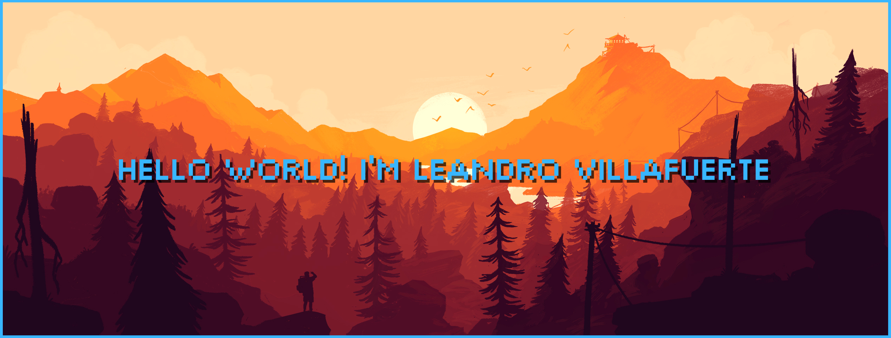
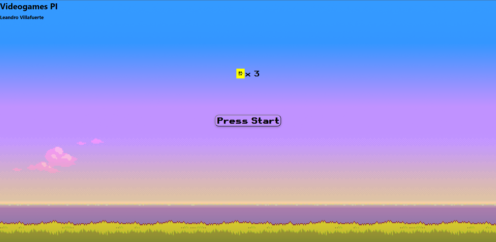
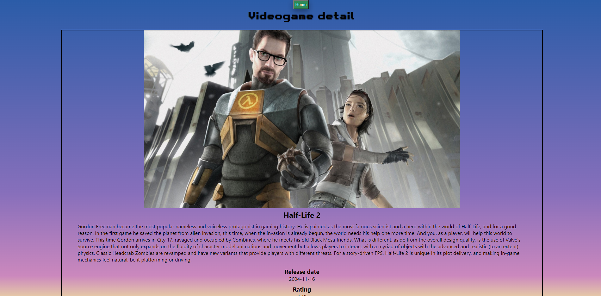
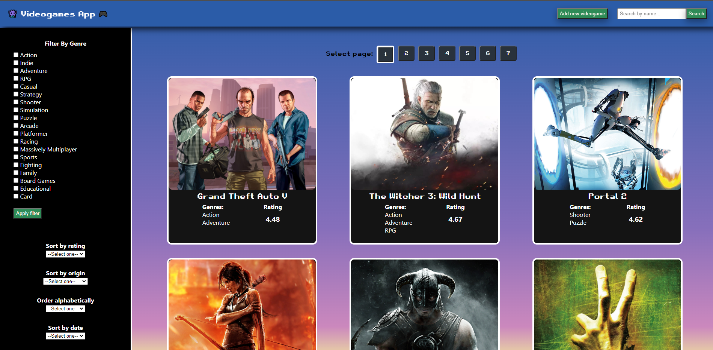
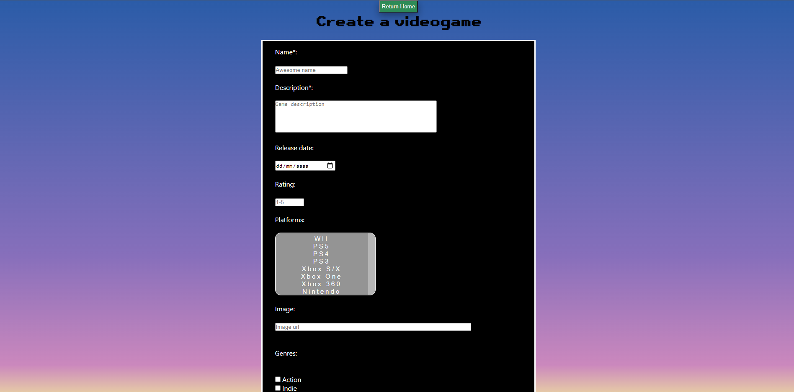
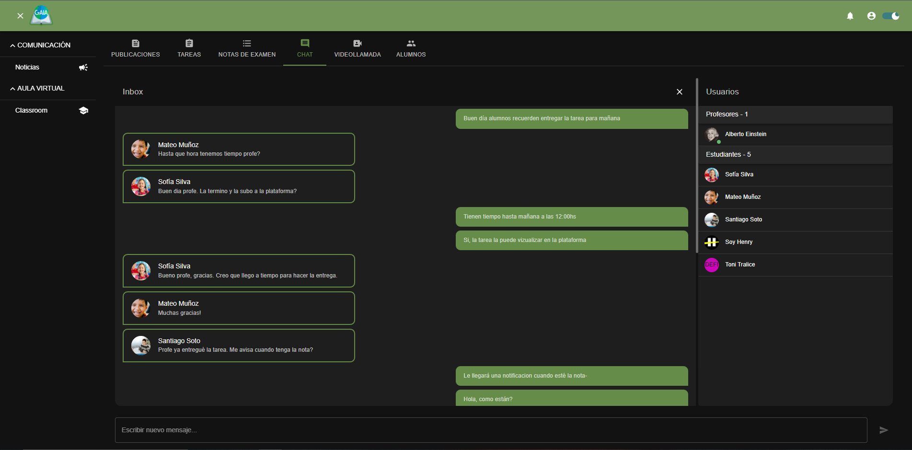
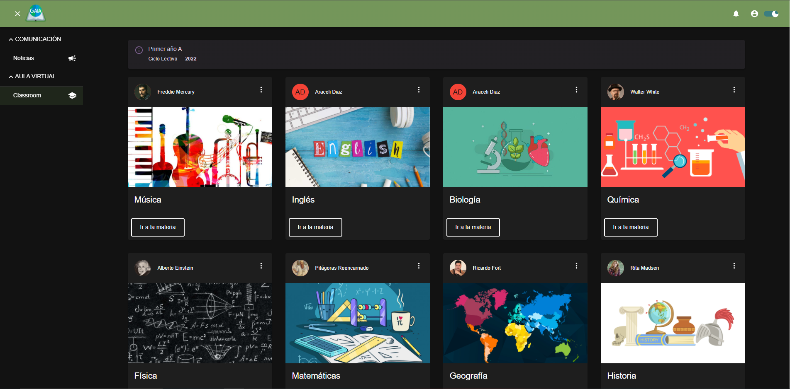
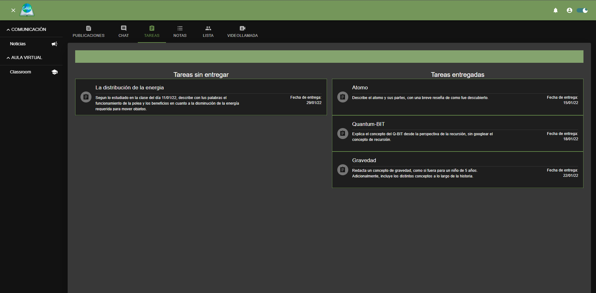

<h2 align="center">
 Full Stack Developer 
</h2>

¡Hola! 👋 Mi nombre es Leandro Villafuerte.

Soy Ingeniero Industrial y Full Stack Developer.

Me fascina la idea de crear, de brindar soluciones allí donde se necesite. Busco aplicar estas pasiones en el desarrollo web donde veo una gran posibilidad de emplear mi creatividad y mi capacidad de resolver problemas.

## ✨Skills✨

## ✨Projects✨
<a href="https://github.com/LeandroVillafuerte/videogames-project">📚Videogames App📚</a>
 
<a href="https://leandrovillafuerte-videogames.vercel.app/">🎮Visit site🎮</a>

ğŸŒGAIA ProjectğŸŒ

<a href="https://github.com/JRS-Developer/pf-client">📚Client📚</a>
<a href="https://github.com/JRS-Developer/pf-server">📚Server📚</a>
<a href="https://github.com/JRS-Developer/pf-chat">📚Chat📚</a>

## 📫 Contacto

